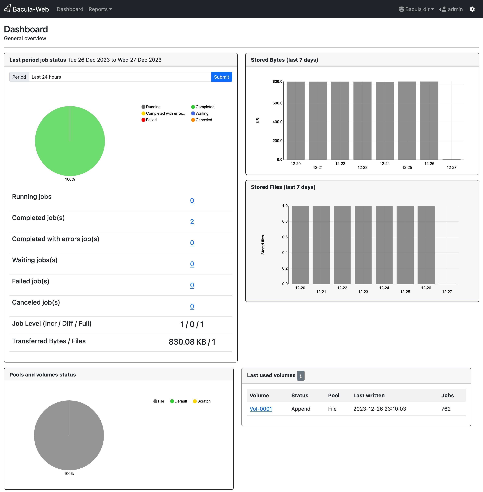

.. Bacula-Web documentation documentation master file, created by
   sphinx-quickstart on Tue Mar  7 16:01:56 2017.
   You can adapt this file completely to your liking, but it should at least
   contain the root `toctree` directive.

===================================
Welcome to Bacula-Web documentation
===================================

.. toctree::
   :maxdepth: 2

   01_about/index
   02_install/index
   03_get-help/index
   04_contribute/index
